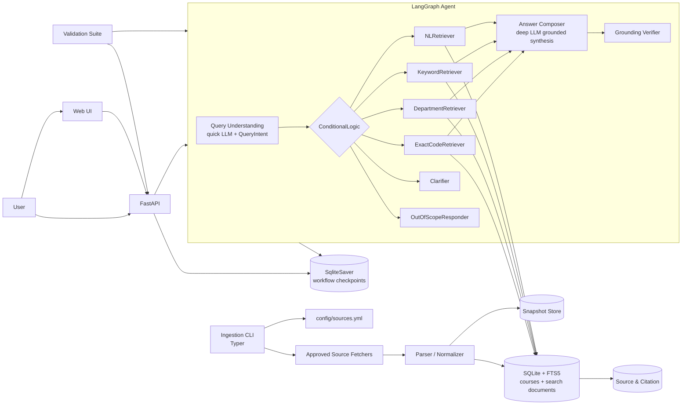

# High-Level Design: UW Course Research Agent MVP

**Feature spec**: `specs/001-course-search/spec.md`  
**Date**: 2026-10-06  
**Status**: Draft architecture hypothesis

## 1. Problem & Scope

### Core functional requirements

1. Search UW Seattle courses by exact course code, department, keyword, and natural-language discovery query.
2. Return source-grounded course facts: title, department, course number, description, credits, prerequisites/corequisites when available.
3. Provide citations and freshness metadata for substantive facts.
4. Maintain explicit workflow state across multi-step course research interactions.
5. Expose both a direct API and a simple Web UI for v1 users.

### Non-functional requirements

- **Source coverage v1**: Official UW catalog/course descriptions and official UW department pages.
- **Freshness model**: Approved indexed/snapshot data only; no dependency on live UW systems.
- **Latency target**: p95 search response under 2 seconds for indexed data; exact course lookup under 500 ms p95.
- **Availability target**: 99.5% for MVP service; graceful degraded responses if an optional component fails.
- **Privacy**: Do not request, store, or use sensitive student information.
- **Auditability**: Every substantive course fact must trace to source metadata and citation evidence.
- **Validation**: Exact lookup, keyword/department search, natural-language retrieval, citations, freshness, missing/conflicting data, and workflow state must be repeatably testable.

### Out of scope

- Live enrollment, seat availability, live registration status, or live schedule changes.
- Private UW systems, student records, advising systems, grades, payment, registration, or enrollment actions.
- Personalized academic advising or degree-planning recommendations not directly supported by retrieved sources.
- UW Bothell/Tacoma course search unless explicitly present in approved UW Seattle sources.
- UW Time Schedule as required v1 coverage. It may be ingested later if provided as approved snapshot data.

### Assumptions

- The first indexed corpus is small to moderate: thousands to tens of thousands of course/source records, not millions.
- Data ingestion is batch-oriented and uses manual snapshot refresh for MVP; scheduled refresh is deferred until after v1.
- Department pages are less structured than catalog data, so v1 treats them primarily as supporting searchable context; they may populate normalized facts only when the fact is clearly structured and directly cited.
- Users care more about correctness, citations, and clear uncertainty than sub-100 ms latency.

## 2. Scale Estimates

These are planning assumptions, not current commitments.

| Metric | MVP assumption | Design implication |
|---|---:|---|
| Courses | 8k–15k records | Single search index is sufficient. |
| Source documents/pages | 10k–50k chunks | Local/managed full-text + vector index is sufficient. |
| Daily active users | 100–1,000 | One stateless API instance plus simple scaling is enough. |
| Peak read QPS | 5–50 QPS | Cache exact lookups and common searches; no sharding needed. |
| Write/import QPS | Manual batch import only | Separate ingestion pipeline from query path; keep scheduled refresh compatible for post-v1. |
| Snapshot size | 100 MB–5 GB | Object/file storage plus indexed metadata is enough. |
| Workflow state | KBs per session | Small transactional store or file-backed store for MVP. |

What the numbers force: retrieval/index quality matters more than distributed scale. The MVP should optimize for trustworthy ingestion, source provenance, and testability rather than sharding or complex service decomposition.

## 3. API / Entry Points

Concrete API and UI shape can evolve, but the architecture assumes these logical entry points.

### Web UI

The Web UI should support:

- Search input for exact code, department, keyword, and natural-language queries.
- Results list with ranked courses and concise summaries.
- Course detail view with citations and freshness metadata.
- Clear limitation banners for snapshot-only/no-live-data behavior.
- Multi-step follow-ups backed by `workflow_id`.

### Search courses

```http
POST /course-search
```

Request:

```json
{
  "query": "intro machine learning courses",
  "filters": {
    "campus": "seattle",
    "department": null,
    "level": null,
    "quarter": null
  },
  "mode": "natural_language",
  "workflow_id": "wf_123"
}
```

Response:

```json
{
  "workflow_id": "wf_123",
  "answer_type": "ranked_courses",
  "results": [
    {
      "course_id": "CSE-446",
      "title": "Machine Learning",
      "department": "CSE",
      "course_number": "446",
      "credits": "4",
      "summary": "...",
      "citations": ["src_uw_catalog_cse_446"],
      "freshness": {
        "snapshot_id": "uw_catalog_2026_10_06",
        "indexed_at": "2026-10-06T00:00:00Z"
      }
    }
  ],
  "limitations": ["Results are from indexed/snapshot sources, not live registration systems."],
  "state_ref": "state_wf_123_v2"
}
```

### Get course details

```http
GET /courses/{course_id}?workflow_id=wf_123
```

Returns normalized course facts plus citation/freshness metadata per field.

### Inspect workflow state

```http
GET /workflows/{workflow_id}
```

Returns active query, filters, selected courses, retrieved source IDs, citations, freshness metadata, unresolved uncertainty, and task status.

### Trigger/administer snapshot ingestion

```http
POST /admin/snapshots/import
```

Restricted/admin-only for MVP operations. Imports approved snapshots or approved source lists through manual refresh. Not part of end-user functionality. The ingestion pipeline should remain compatible with scheduled refresh after v1.

## 4. High-Level Architecture

V1 is implemented as a **LangGraph agent** following the `TradingAgents` reference design.



### LangGraph state

The graph operates over `CourseResearchState(MessagesState)` with fields `query`, `intent`, `interpreted_filters`, `retrieved_courses`, `citations`, `freshness`, `answer`, `structured_answer`, `limitations`, `conflicts`, `needs_clarification`, and `status`. The full state is checkpointed by `SqliteSaver` per `workflow_id`, which realizes the persistent workflow-state requirement.

### Component responsibilities

- **Web UI**: Simple static browser interface for search, result inspection, citations/freshness display, limitation messages, and workflow-state-backed follow-ups.
- **FastAPI**: Serves the Web UI and the `POST /course-search`, `GET /courses/{id}`, `GET /workflows/{id}`, and `POST /admin/snapshots/import` endpoints; delegates each search to the LangGraph agent.
- **Query Understanding**: Produces a structured `QueryIntent` (intent + parsed filters); see `classify_query` in `courseagent/agents/query_understanding.py` for the deterministic and quick-tier LLM routing policy.
- **ConditionalLogic**: Deterministic router mapping `intent` to the matching retrieval node or responder.
- **Retrieval nodes**: Deterministic SQLite/FTS lookups (`exact_code`, `department`, `keyword`, `natural_language`) that populate `retrieved_courses`, `citations`, and `freshness`. No live UW systems.
- **Answer Composer**: Deep-tier LLM grounded synthesis that may only restate retrieved, cited facts.
- **Grounding Verifier**: Deterministic check that substantive claims carry citations; uncited claims are downgraded to limitations.
- **Clarifier / OutOfScopeResponder**: Ambiguity follow-up and out-of-scope/live-only limitation responses.
- **SqliteSaver checkpointer**: Persistent, resumable workflow state per `workflow_id`.
- **SQLite + FTS5 store**: Normalized course records, source/citation records, and full-text search documents.
- **Ingestion CLI**: Fetches approved sources, parses content, normalizes catalog records, chunks department pages as searchable context, and updates indexes.
- **Snapshot Store**: Preserves raw/source snapshots for reproducibility and citation traceability.
- **Validation Suite**: Golden queries and expected behaviors for exact lookup, search, NL retrieval, citations, freshness, missing/conflicting data, privacy, and state preservation.

## 5. Data Model

### Course

Primary key: `course_id = {department}-{course_number}` such as `CSE-142`.

Fields:

- `course_id`
- `campus`
- `department_code`
- `course_number`
- `title`
- `description`
- `credits`
- `prerequisites`
- `corequisites`
- `source_field_provenance`
- `freshness_metadata`

### CourseSource

Primary key: `source_id`.

Fields:

- `source_id`
- `source_type`: `uw_catalog`, `uw_course_description`, `uw_department_page`, `approved_snapshot`, `user_document`
- `url_or_document_id`
- `title`
- `snapshot_id`
- `retrieved_at`
- `indexed_at`
- `raw_content_ref`
- `authority_level`

### Citation

Primary key: `citation_id`.

Fields:

- `citation_id`
- `source_id`
- `course_id`
- `claim_field`
- `evidence_text`
- `url_or_document_id`
- `retrieved_at`
- `snapshot_id`

### WorkflowState

Primary key: `workflow_id`.

Fields:

- `workflow_id`
- `active_query`
- `interpreted_filters`
- `selected_courses`
- `retrieved_source_ids`
- `citation_ids`
- `freshness_metadata`
- `unresolved_uncertainty`
- `status`
- `updated_at`

## 6. Key Decisions & Trade-offs

| Decision | Solves | Worsens | Change it when |
|---|---|---|---|
| Batch indexed/snapshot data, no live dependency | Reproducibility, validation, safety, lower UW-system risk | Answers may be stale versus live course systems | v2 explicitly requires live availability with authorization and freshness guarantees |
| Structured retrieval before answer generation | Reduces hallucination and makes citations enforceable | More ingestion/indexing work before UX feels smart | Source coverage becomes too broad for curated structured ingestion alone |
| One Course Research API service for MVP | Simple deployment and easier state/retrieval coordination | Service can become too broad as ingestion/search/answer logic grows | Team size or traffic requires independent scaling/deploys |
| Manual batch ingestion separated from query path | Keeps user queries fast, simple, reproducible, and avoids live-source failures | Data is not automatically updated after source changes | Scheduled refresh is required, or freshness requirements become near-real-time |
| Full-text search plus optional vectors | Supports keyword and simple natural-language discovery | Vector retrieval can return plausible but imprecise matches | Validation shows semantic retrieval reduces precision or citations cannot support matches |
| Strict department-page extraction | Keeps normalized facts authoritative and lowers hallucination/extraction risk | Some useful department-page facts may remain searchable context instead of structured fields | Validation shows catalog/course descriptions miss too many required facts and department pages contain reliably structured evidence |
| Field-level provenance in metadata | Enables citations and conflict surfacing | Increases parsing/storage complexity | MVP only returns whole-record citations and field-level evidence is deferred |
| Explicit WorkflowState store | Supports repeatability and multi-step state inspection | Adds persistence and cleanup lifecycle | Product becomes single-turn only or state can be safely client-owned |

## 7. Failure Modes & Degradation

| Failure | User-facing degradation | Recovery / mitigation |
|---|---|---|
| Search index unavailable | Exact lookup may fall back to Course Metadata Store; broad search returns temporary degraded message | Health checks, rebuild index from snapshot/object store |
| Course Metadata Store unavailable | API returns service unavailable for fact answers; avoid uncited/generated answers | Backups, restore from latest normalized snapshot |
| Source/Citation Store unavailable | Do not return substantive facts without citations; return degraded message | Restore citation store from snapshots; block unsafe answer generation |
| Ingestion pipeline fails | Existing snapshot remains queryable; freshness metadata shows last successful index | Alert on failed import; retry batch safely; no query-path dependency |
| Department page parsing produces low-confidence data | Keep it as searchable context only; do not promote to normalized course facts | Parser validation; conflict surfacing; source priority rules |
| Conflicting sources | Surface conflict with source IDs instead of choosing silently | Source authority ranking and conflict test cases |
| User asks live-only question | Explain live data is out of scope and cite available snapshot if relevant | Standard live-only response template |
| Natural-language query is ambiguous | Ask a clarification or return ranked possibilities with limitations | Track ambiguity in WorkflowState |

## 8. Scale Evolution

### Current bottlenecks

1. Ingestion quality and source normalization.
2. Retrieval precision for natural-language search.
3. Citation/evidence alignment.

### 10× growth

At ~500 QPS or >100k documents:

- Add API replicas behind a load balancer.
- Move search to a managed search service or dedicated search cluster.
- Cache exact course-code lookups and common department searches.
- Add scheduled ingestion jobs with versioned index swaps.

### 100× growth

At multi-region or millions of documents:

- Separate services: Ingestion Service, Search Service, Answer Service, Workflow State Service.
- Partition indexes by corpus/source type or campus if scope expands.
- Add asynchronous evaluation jobs and index-quality monitoring.
- Consider CDN/static delivery for public course-detail pages if exposed.

## 9. Source Allowlist & Ingestion Design

V1 should make source coverage explicit through a checked-in source registry. This keeps ingestion reproducible, prevents accidental live/open-web dependence, and makes source coverage visible in validation.

### Source tiers

| Tier | Source type | V1 role | Normalized fact policy |
|---|---|---|---|
| Tier 1 | Official UW catalog/course-description pages | Primary course facts | May populate normalized fields such as title, course number, credits, description, prerequisites/corequisites when directly parsed and cited. |
| Tier 2 | Official UW department pages | Supporting context and discovery | Searchable context by default; may populate normalized facts only when clearly structured and directly cited. |
| Tier 3 | Approved local snapshots/user-provided documents | Optional supporting data | Must be labeled by source type and authority; cannot silently override Tier 1. |
| Excluded | Live registration/time-schedule systems | Out of scope for v1 | No live enrollment, seats, live schedule, or registration-status facts. |

### Source registry

Keep an explicit registry, for example `config/sources.yml`, with one entry per approved source or source group.

```yaml
snapshot_policy:
  refresh_mode: manual
  scheduled_refresh: post_v1
  campus_scope: seattle

sources:
  - id: uw_course_catalog
    tier: 1
    type: uw_course_description
    authority: official
    base_url: "https://www.washington.edu/students/crscat/"
    allowed_url_patterns:
      - "https://www.washington.edu/students/crscat/*.html"
    extraction_policy: normalized_facts_allowed
    required_fields:
      - department_code
      - course_number
      - title
      - description
      - credits
    freshness:
      source_date: optional
      retrieved_at: required
      indexed_at: required

  - id: official_department_pages
    tier: 2
    type: uw_department_page
    authority: official
    allowed_domains:
      - "*.washington.edu"
      - "*.uw.edu"
    allowed_url_patterns: [] # filled with approved department URLs before ingestion
    extraction_policy: supporting_context_by_default
    promotion_rule: clearly_structured_and_directly_cited_only
    freshness:
      retrieved_at: required
      indexed_at: required
```

### Initial allowlist process

1. Start with the provided Tier 1 CSE and INFO UW course catalog pages.
2. Add the provided Tier 2 CSE and INFO official department pages as supporting context, rather than crawling all UW domains.
3. Require every source entry to include source type, tier, authority, allowed URL pattern/domain, extraction policy, and freshness requirements.
4. Store raw snapshots with `snapshot_id`, `retrieved_at`, and `indexed_at` so validation can reproduce answers.
5. Treat any source not in the registry as unapproved; do not ingest it automatically.

### Initial v1 source seed

The initial checked-in source registry is `config/sources.yml` and contains:

| Source | Tier | Type | Department | URL | V1 role |
|---|---:|---|---|---|---|
| UW CSE Catalog | 1 | `course_catalog` | CSE | `https://www.washington.edu/students/crscat/cse.html` | Primary normalized course facts |
| Allen School | 2 | `department` | CSE | `https://www.cs.washington.edu/` | Supporting searchable context; strict promotion only |
| UW INFO Catalog | 1 | `course_catalog` | INFO | `https://www.washington.edu/students/crscat/info.html` | Primary normalized course facts |
| UW Informatics | 2 | `department` | INFO | `https://ischool.uw.edu/programs/informatics` | Supporting searchable context; strict promotion only |

### Department-page promotion rule

A department-page statement may become a normalized course fact only if all are true:

- It is on an approved official UW department URL.
- It is clearly associated with a specific course identifier or official course title.
- The fact appears in structured or near-structured form, such as a course table, heading, catalog-like listing, or labeled prerequisite/credit field.
- The answer can cite the exact department page and evidence snippet.
- It does not conflict with Tier 1. If it conflicts with Tier 1, surface the conflict rather than overwriting Tier 1.

Otherwise, department-page content remains searchable supporting context.

### Source priority order

1. Tier 1 official UW catalog/course-description sources.
2. Tier 2 official UW department pages with clear direct evidence.
3. Tier 3 approved snapshots/user documents, labeled as such.
4. Open-ended web search is not authoritative for v1 course facts unless explicitly approved and labeled; it should not be part of the default v1 path.

### Validation impact

The validation suite should include source-coverage tests:

- Unregistered URL is rejected by ingestion.
- Tier 1 catalog facts populate normalized course fields with citations.
- Tier 2 department-page prose is indexed as searchable context but not promoted to normalized facts.
- Tier 2 structured course fact can be promoted only with direct citation.
- Tier 2 conflict with Tier 1 is surfaced as a conflict, not silently overwritten.
- Every returned source includes `snapshot_id`, `retrieved_at`, and `indexed_at` when available.

## 10. Observability & Validation

### Metrics

- Search latency p50/p95/p99 by query type.
- Exact lookup success rate.
- Top-5 relevance rate for keyword/department/NL validation sets.
- Citation coverage rate.
- Unsupported-claim refusal rate.
- Snapshot age and last successful ingestion time.
- Conflict detection count.
- Live-only query count.

### Logs/events

- Query interpreted filters, retrieval strategy, result IDs, citation IDs, and limitation codes.
- Do not log sensitive student information; redact obvious sensitive values.

### Validation suite

- Exact course-code golden set.
- Department and keyword search golden set.
- Natural-language course discovery golden set.
- Prerequisite/corequisite supported and unsupported cases.
- Quarter-specific availability unavailable cases.
- Conflict and stale-source cases.
- Workflow-state persistence cases.
- Privacy-sensitive input cases.

## 11. Open Questions

- Should the first implementation include only CSE and INFO validation cases, or should additional departments be added after the initial vertical slice?

## 12. Quality Score & Diagnostic

| Dimension | Score / 5 | Notes |
|---|---:|---|
| Requirements clarity | 5 | Spec clarifies campus, no-live policy, source coverage, and NL scope. |
| Scale estimates | 4 | MVP estimates are explicit, but real user/load targets are not confirmed. |
| API/data model concreteness | 4 | Core APIs and entities are concrete; exact persistence technology is deferred. |
| Trade-off articulation | 5 | Each major decision includes solves/worsens/change trigger. |
| Failure/degradation | 5 | Critical dependencies have degradation paths. |
| Evolution path | 4 | 10×/100× plan exists; specific metrics need real baseline data. |

**Total**: 27/30

Weakest dimension: initial implementation breadth. To raise the design, decide whether the first vertical slice should validate only CSE and INFO or include more departments after the source-registry machinery is working.
